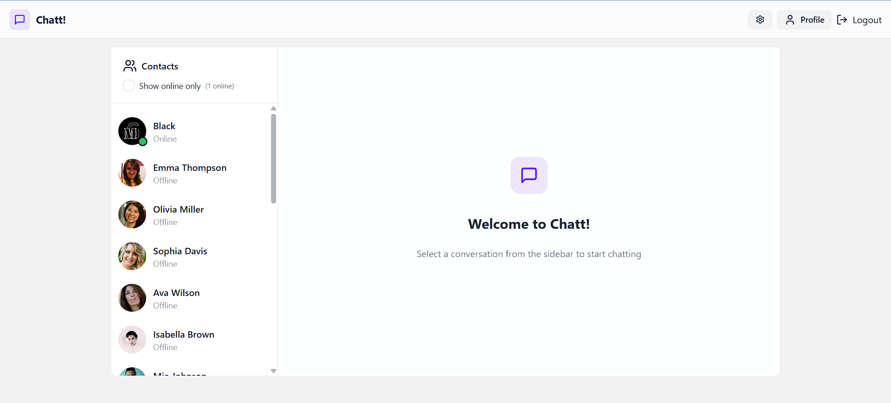

# 💬 Live Chat App

  

A real-time full-stack chat application built with the **PERN stack**, featuring user authentication, live messaging, online status, theming, and image sharing.

---

## 🛠 Tech Stack

- **Frontend:** React, TailwindCSS, Daisy UI
- **Backend:** Node.js, Express, Prisma
- **Database:** PostgreSQL
- **Real-Time Communication:** Socket.io
- **Authentication:** JWT (JSON Web Tokens)
- **State Management:** Zustand
- **Deployment:** Render

---

## ✨ Features

- 🔐 **Authentication & Authorization**
  - Secure login & signup using JWT
  - Profile picture upload

- 💬 **Real-Time Messaging**
  - Live one-on-one chat with Socket.io
  - Supports sending images and text
  - See online/offline user status

- 🌐 **Pages**
  - `Login`, `Signup`, `Home (Chat)`, `Profile`, `Settings`

- 🎨 **Theming**
  - Theme switching with Daisy UI

- 💾 **Global State**
  - Managed using Zustand

- ⚠️ **Error Handling**
  - Robust client and server-side error feedback

---